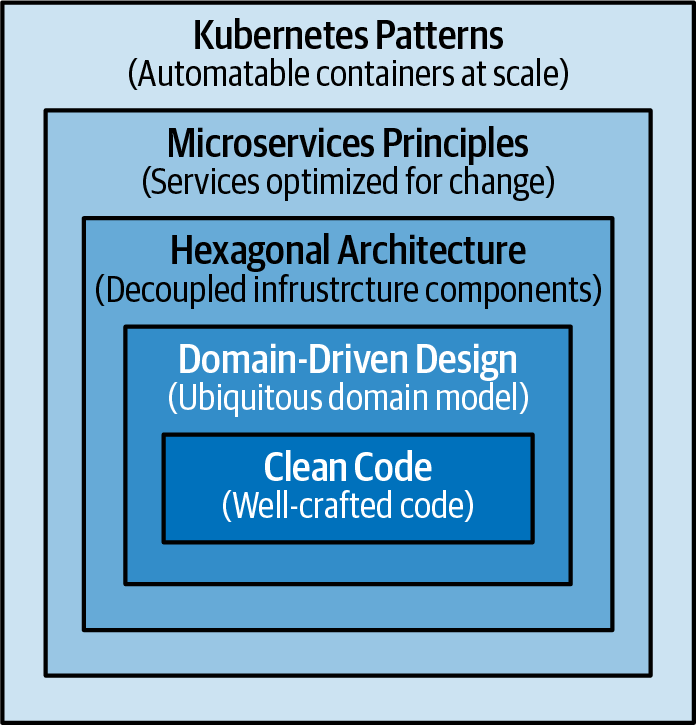
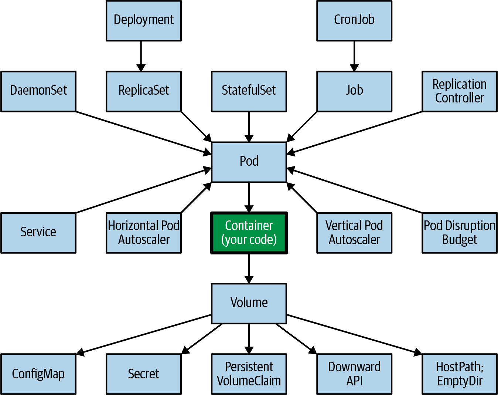

- 
	- website:: https://k8spatterns.com/
	  code:: [Github](https://github.com/k8spatterns)
- ## Chapter-1 Introduction
	- ## Where does kubernetes patterns fits in the whole application hierarchy
	  collapsed:: true
		- 
	- ## Main Components
		- [[Clean Code]]
		- [[Domain Driven Design]]
		- [[Hexagonal Architecture]]
		- [[Microservices Architectural Style - 12 Factor App]]
		- [[Containers]]
	- ## Comparision concept vs local primitive vs distributed primitive
	  collapsed:: true
		- | Concept                          | Local Primitive                                  | Distributed Primitive             |
		  |----------------------------------|--------------------------------------------------|-----------------------------------|
		  | Behavior encapsulation           | Class                                            | Container image                   |
		  | Behavior instance                | Object                                           | Container                         |
		  | Unit of reuse                    | .jar                                             | Container image                   |
		  | Composition                      | Class A contains Class B                         | Sidecar pattern                   |
		  | Inheritance                      | Class A extends Class B                          | A container’s FROM parent image   |
		  | Deployment unit                  | .jar/.war/.ear                                   | Pod                               |
		  | Buildtime/Runtime isolation      | Module, package, class                           | Namespace, Pod, container         |
		  | Initialization preconditions    | Constructor                                      | Init container                    |
		  | Postinitialization trigger       | Init-method                                      | postStart                         |
		  | Predestroy trigger               | Destroy-method                                   | preStop                           |
		  | Cleanup procedure                | finalize(), shutdown hook                        | -                                 |
		  | Asynchronous and parallel exec. | ThreadPoolExecutor, ForkJoinPool                 | Job                               |
		  | Periodic task                    | Timer, ScheduledExecutorService                  | CronJob                           |
		  | Background task                  | Daemon thread                                    | DaemonSet                         |
		  | Configuration management         | System.getenv(), Properties                      | ConfigMap, Secret                 |
	- ## Common Kubernetes resources
	  collapsed:: true
		- 
- ## Chapter-2 Foundation Patterns #pending
  collapsed:: true
	- > Foundational patterns describe a number of fundamental principles that containerized
	  applications must comply with in order to become good cloud-native citizens.
	  Adhering to these principles will help ensure that your applications are suitable for
	  automation in cloud-native platforms such as Kubernetes.
	- ## Predictable Demands
		- ### Runtime Dependency
			- ## `File Storage`
			  collapsed:: true
				- One of the most common runtime dependencies is file storage for saving application
				  state. Container filesystems are ephemeral and are lost when a container is shut
				  down. Kubernetes offers volume as a Pod-level storage utility that survives container
				  restarts.
				- > `Persistent Volume` can be used to tackle runtime dependencies
				- ```yaml
				  apiVersion: v1
				  kind: Pod
				  metadata:
				  	name: random-generator
				  spec:
				  	containers:
				  	- image: k8spatterns/random-generator:1.0
				  	  name: random-generator
				  	  volumeMounts:
				  	  - mountPath: "/logs"
				  	    name: log-volume
				  	volumes:
				  	- name: log-volume
				  	  persistentVolumeClaim:
				  		claimName: random-generator-log
				  ```
			- ## `HostPort`
			  collapsed:: true
				- A similar dependency happens when you ask Kubernetes to expose a `container port`
				  on a specific port on the host system through `hostPort`. The usage of a hostPort
				  creates another runtime dependency on the nodes and limits where a Pod can be
				  scheduled. hostPort reserves the port on each node in the cluster and is limited to a
				  maximum of one Pod scheduled per node. Because of port conflicts, you can scale to
				  as many Pods as there are nodes in the Kubernetes cluster.
			- ## `ConfigMaps`
			  collapsed:: true
				- Configurations are another type of dependency. Almost every application needs some
				  configuration information, and the recommended solution offered by Kubernetes is
				  through ConfigMaps. Your services need to have a strategy for consuming settings—
				  either through environment variables or the filesystem. In either case, this introduces
				  a runtime dependency of your container to the named ConfigMaps. If not all of the
				  expected ConfigMaps are created, the containers are scheduled on a node, but they
				  do not start up.
				- ```yaml
				  apiVersion: v1
				  kind: Pod
				  metadata:
				    name: random-generator
				  spec:
				    containers:
				      - image: k8spatterns/random-generator:1.0
				        name: random-generator
				  env:
				  - name: PATTERN
				    valueFrom:
				    configMapKeyRef:
				      name: random-generator-config
				      key: pattern
				  ```
		- ### Resource Profiles
			- The resources are categorized as `compressible` (i.e., can
			  be `throttled`, such as ==CPU or network bandwidth==) and `incompressible` (i.e., cannot be
			  throttled, such as ==memory==).
			- If your containers consume too many `compressible` resources such as CPU, they
			  are `throttled`, but if they use too many `incompressible` resources (such as memory),
			  they are `killed` 💀
			- > The requests amount (**but not limits**) is used by the scheduler when placing
			  Pods to nodes
			- ```yaml
			  apiVersion: v1
			  kind: Pod
			  metadata:
			  	name: random-generator
			  spec:
			  	containers:
			      - image: k8spatterns/random-generator:1.0
			        name: random-generator
			      resources:
			          requests:
			              cpu: 100m
			              memory: 200Mi
			          limits:	
			              memory: 200Mi
			  ```
			- >  **Recommendations for CPU and Memory Resources** 
			   1. For memory, always set requests equal to limits.
			   2. For CPU, set requests but no limits.
				- ### Types of resource that can be used as keys
					- cpu
					- memory
					- ephemeral-storage
					- hugepage-<size>
				- ### Types of service provided by platform
					- `Best Effort`
						- > Pods that `do not have any requests and limits` set for its containers have a
						  QoS of Best-Effort. Such a Best-Effort Pod is considered the `lowest priority` and
						  is most likely `killed first` when the node where the Pod is placed runs out of
						  `incompressible` resources
					- `Burstable`
						- > A Pod that defines an unequal amount for requests and limits values (and
						  `limits is larger than requests`, as expected) are tagged as Burstable. Such a Pod
						  has minimal resource guarantees but is also willing to consume more resources
						  up to its limit when available. When the node is under incompressible resource
						  pressure, these Pods are likely to be `killed if no Best-Effort Pods remain`.
					- `Guaranteed`
						- > A Pod that has `an equal amount of request and limit` resources belongs to the Guaranteed QoS category. These are the `highest-priority` Pods and are guaranteed
						  `not to be killed before Best-Effort and Burstable Pods`. This QoS mode is the best
						  option for your application’s memory resources, as it entails the least surprise and
						  `avoids out-of-memory triggered evictions.`
					-
- ## Chapter-3 Declarative Deployment
  collapsed:: true
	- ### kubectl rollout
- ## Chapter-4 Health Probe
  collapsed:: true
	- ### Readiness Probe
	- ### LiveNess Probe
- ## Chapter-5 Managed Lifecycle
  collapsed:: true
	- ### PostStart Hook
	- ### PreStop Hook
- ## Chapter-6 Automated Placement
  collapsed:: true
	- ### Note Affinity
	- ### Taint and Tolerations